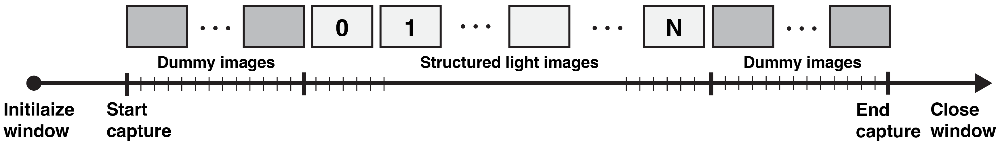
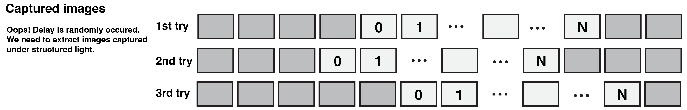
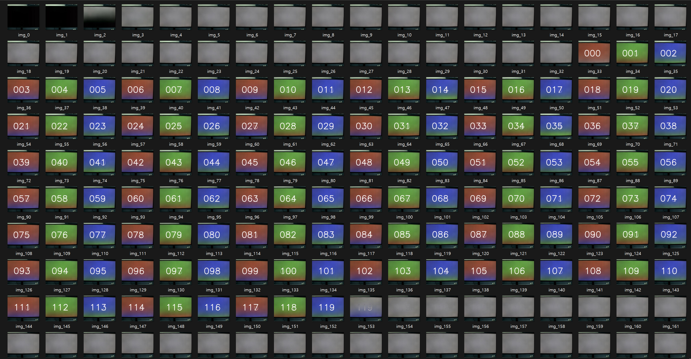

# GL imshow in Python

This repository provides programs to display images in Python via OpenGL. The main purpose is for structured light illumination, particularly for nearly synchronized image capturing in projector-camera or display-camera systems.

The core rendering program is borrowed from [kamino410/gl_imshow](https://github.com/kamino410/gl_imshow) developed by [Takumi Kaminokado](https://kamino410.github.io/). I have modified the original C++ code and bound it to Python using nanobind. I acknowledge and respect his pioneering work.

## Installation

You first need to clone this repository.

```shell
git clone --recursive-submodules https://github.com/elerac/pyglimshow.git
```

To build the C++ extension, you need to prepare the build environment of OpenGL through cmake. GLFW and GLEW are downloaded as submodules. As a Python environment, you need to prepare [nanobind](https://github.com/wjakob/nanobind).

This repository includes a script to build the C++ code. You can build the code by running the following command.

```shell
python build_cpp.py
```

The built binary is saved to the `pyglimshow/` directory, and you can import the Python module using the following code.

```python
import pyglimshow
```

Once the compilation is complete, you can relocate the `pyglimshow/` directory to your working directory.

## Usage

The following code is a simple example of showing the image on fullscreen.

```python
import time
import numpy as np
import pyglimshow

# Initialize a window
screen = pyglimshow.FullScreen()

# Get the screen size
width = screen.width
height = screen.height

# Create an image
img_rgb = np.fromfunction(lambda y, x, c: 128 * (c == 2) + x / (width - 1) * 255 * (c == 0) + y / (height - 1) * 255 * (c == 1), (height, width, 3)).astype(np.uint8)

# Display the image
screen.imshow(img_rgb)

# Do some tasks here
time.sleep(3)
```

The "imshow" method calls the ["glfwSwapBuffers"](https://www.glfw.org/docs/3.0/group__context.html#ga15a5a1ee5b3c2ca6b15ca209a12efd14) function, which swaps the image and waits for the swap using vsync. This ensures that the image is changed after the "imshow" method is finished. However, I have found that vsync can not always be utilized for synchronized image capture. I'll discuss this issue for procam synchronization capture in the next section.

If you are working on time-sensitive tasks, uploading and rendering a large image may be crucial. You can use "set_next"and "swap_buffers" methods instead of "imshow".

```python
# Upload and draw the image before showing.
# The image is not displayed in this line.
screen.set_next(img_rgb)

# Swap the image that is set at the previous line.
# The image will be displayed after this line.
screen.swap_buffers()
```

Note that, as mentioned in the original code, [a byte size of the columns of the image must be divisible by 4](https://github.com/kamino410/gl_imshow/blob/706c93d440bb377be505d0703913c866e45f6ede/main.cpp#L73-L75). This wrapper does not check the byte size, so you need to ensure that the image size is appropriate.

## Projector-Camera Synchronization Capture

To achieve fast structured light capture, we need to be able to swap images at the display refresh rate and ensure that the projector (or display) and camera can capture images in sync reliably. The pyglimshow provides a fast imshow function via OpenGl backend, and thus, we can use the vertical synchronization (VSync) feature in GLFW to wait until the buffer is swapped.

### Problem

I thought if I execute a camera trigger after finishing the glfwSwapBuffers function, the camera captures the swapped image from a projector. I tested it on my Windows machine with a 60 Hz monitor but found unexpected behavior. Here is my observation of display-camera synchronization capture with vsync.

- The displayed image tends to be delayed. The camera captures an image that should be displayed in the previous few frames. And this delay occurs randomly.
- The "glfwSwapBuffers" function occasionally does not wait at 60Hz; it finishes the execution immediately. This failer case tends to occur at first several frames, and it is getting stable and waiting appropriately.

Finding the exact cause and fixing the bug seems difficult because there are several possible factors, such as OpenGL, OS, GPU, and display, which are hard for us to control.

### Ad-hoc Solution

In order to bypass the above issue, I suggest the following procedure for capturing with a projector and camera. This procedure employs the extra dummy images before and after capturing structured light images. 



During the capturing process, the camera will capture the following sequence of images. In each capture try, the initial frame is randomly altered for some unknown reason. The first several frames often fail to synchronize, but the later frames become stable. We are able to extract the images captured under structured light which are synchronized with the display.



### Result

#### Monitor-Camera Synchronization

I have tested the ad-hoc solution on my Windows machine with a 60 Hz monitor (SAMSUNG, U32J590UQK), which is connected to the NVIDIA GeForce RTX 4070 GPU via an HDMI cable. The camera is FLIR Blackfly S (BFS-U3-13Y3C). The code is attached in `procam_capture.py`.

The following image is captured images. I put the number of structured light images in the center of each image, and the background is red/green/blue in the order of the number. I used 30 dummy images (gray color) before and after the structured light images. Please zoom in on the image to see the numbers.



The captured images mainly show sequential numbers, but some images have the ghost of the previous/next image. And also, synchronization sometimes fails. These issues remain a limitation of this method.

#### Projector-Camera Synchronization

In addition to the monitor-camera synchronization, a projector-camera system is tested by [Suhyun et al., "Dense Dispersed Structured Light for Hyperspectral 3D Imaging of Dynamic Scenes"](https://shshin1210.github.io/DDSL/).
The camera is FLIR Blackfly S (BFS-U3-13Y3C), and the projector is Epson CO-FH02, which is connected to the NVIDIA GeForce RTX 3060 GPU via an HDMI cable. As demonstrated in the paper, we successfully captured structured light images at 60 fps.
